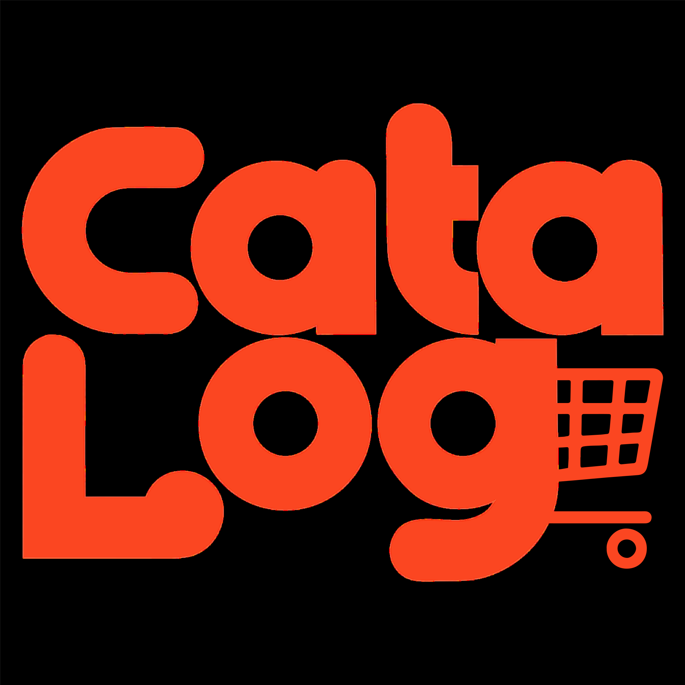

<p align="center">
  
</p>

<h1 align="center">Cata Log</h1>

<p align="center">
  <strong>Hub de Visibilidade e Letramento Digital para Microempreendedores da Cultura Pernambucana</strong>
</p>

<p align="center">
  
</p>

<br>

O **Cata Log** é um Marketplace Cultural desenhado especificamente para abstrair a complexidade tecnológica e dar visibilidade aos pequenos produtores de Pernambuco. 

A plataforma atua aliada a um processo de letramento digital, garantindo a autonomia desses empreendedores sem a complexidade operacional de um e-commerce tradicional.

---

## 🎯 O Problema e a Solução
Mestres artesãos e pequenos produtores esbarram na barreira financeira e no baixo letramento digital para manter lojas virtuais complexas. 

**Nossa Solução:** Uma vitrine unificada sem fricção. O consumidor explora a cultura local e negocia diretamente via WhatsApp com um clique. Para o artesão, um aplicativo de bolso ágil para fotografar e catalogar suas obras na mesma hora em que ficam prontas.

## 🏗️ Arquitetura do Sistema
O ecossistema foi projetado com separação de responsabilidades (Separation of Concerns) para garantir segurança e performance:

* **Vitrine Digital (B2C):** SPA pública para os consumidores descobrirem peças e artesãos.
* **Aplicativo Mobile (B2B):** Ferramenta de uso exclusivo do artesão para gestão ágil do seu ateliê.
* **Painel Administrativo:** Área restrita para a equipe realizar a curadoria cultural e moderação da plataforma.
* **API RESTful:** Motor central do sistema que gerencia a persistência, segurança (JWT) e regras de negócio.

## 🚀 Tecnologias Utilizadas

**Backend:**
* Java 17+
* Spring Boot (Web, Security, Data JPA)
* PostgreSQL
* Docker (Conteinerização)

**Frontend Web:**
* React (Vite)
* Tailwind CSS / Bootstrap
* React Router DOM / Axios

**Frontend Mobile:**
* Flutter
* Dart

## ⚙️ Como executar o projeto (Em breve)
As instruções de inicialização dos ambientes de desenvolvimento estarão disponíveis assim que a fase de codificação (Sprints) for iniciada.

```bash
# Exemplo futuro de clonagem
git clone [https://github.com/paulosnp/cata-log.git](https://github.com/paulosnp/cata-log.git)
```
--- Equipe do Projeto ---
Paulo Ricardo Cardoso: Líder do Projeto / Desenvolvedor Backend

João Pedro Pontes: Desenvolvedor Frontend / UX/UI Design

Eduardo Dourado: Desenvolvedor Backend

Vitória: Documentação / Dreamshaper

Caio Henrique: Documentação / Dreamshaper

Rafael Santana: Documentação / Dreamshaper
